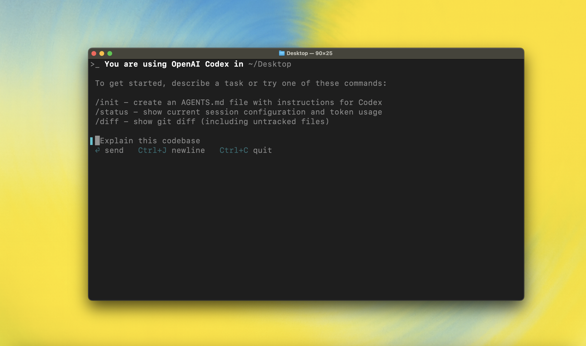

<h1 align="center">OpenAI Codex CLI</h1>

<p align="center">`npm i -g @openai/codex`<br />or `brew install codex`</p>

<p align="center"><strong>Codex CLI</strong> is a coding agent from OpenAI that runs locally on your computer.</br>If you are looking for the <em>cloud-based agent</em> from OpenAI, <strong>Codex Web</strong>, see <a href="https://chatgpt.com/codex">chatgpt.com/codex</a>.</p>

<p align="center">
  
  </p>

---

## Quickstart

### Installing and running Codex CLI

Install globally with your preferred package manager. If you use npm:

```shell
npm install -g open-codex
```

Alternatively, if you use Homebrew:

```shell
brew install codex
```

Then simply run `codex` to get started:

```shell
open-codex
```

---

## Why Codex?

Codex CLI is built for developers who already **live in the terminal** and want
ChatGPT‑level reasoning **plus** the power to actually run code, manipulate
files, and iterate – all under version control. In short, it's _chat‑driven
development_ that understands and executes your repo.

- **Zero setup** — bring your API key and it just works!
- **Multiple AI providers** — use OpenAI, Gemini, OpenRouter, or Ollama!
- **Full auto-approval, while safe + secure** by running network-disabled and directory-sandboxed
- **Multimodal** — pass in screenshots or diagrams to implement features ✨

And it's **fully open-source** so you can see and contribute to how it develops!

---

## Security Model & Permissions

Codex lets you decide _how much autonomy_ the agent receives and auto-approval policy via the
`--approval-mode` flag (or the interactive onboarding prompt):

| Mode                      | What the agent may do without asking            | Still requires approval                                         |
| ------------------------- | ----------------------------------------------- | --------------------------------------------------------------- |
| **Suggest** <br>(default) | • Read any file in the repo                     | • **All** file writes/patches <br>• **All** shell/Bash commands |
| **Auto Edit**             | • Read **and** apply‑patch writes to files      | • **All** shell/Bash commands                                   |
| **Full Auto**             | • Read/write files <br>• Execute shell commands | –                                                               |

In **Full Auto** every command is run **network‑disabled** and confined to the
current working directory (plus temporary files) for defense‑in‑depth. Codex
will also show a warning/confirmation if you start in **auto‑edit** or
**full‑auto** while the directory is _not_ tracked by Git, so you always have a
safety net.

Coming soon: you'll be able to whitelist specific commands to auto‑execute with
the network enabled, once we're confident in additional safeguards.

### Platform sandboxing details

The hardening mechanism Codex uses depends on your OS:

- **macOS 12+** – commands are wrapped with **Apple Seatbelt** (`sandbox-exec`).

  - Everything is placed in a read‑only jail except for a small set of
    writable roots (`$PWD`, `$TMPDIR`, `~/.codex`, etc.).
  - Outbound network is _fully blocked_ by default – even if a child process
    tries to `curl` somewhere it will fail.

- **Linux** – there is no sandboxing by default.
  We recommend using Docker for sandboxing, where Codex launches itself inside a **minimal
  container image** and mounts your repo _read/write_ at the same path. A
  custom `iptables`/`ipset` firewall script denies all egress except the
  OpenAI API. This gives you deterministic, reproducible runs without needing
  root on the host. You can use the [`run_in_container.sh`](./codex-cli/scripts/run_in_container.sh) script to set up the sandbox.

---

## System Requirements

| Requirement                 | Details                                                         |
| --------------------------- | --------------------------------------------------------------- |
| Operating systems           | macOS 12+, Ubuntu 20.04+/Debian 10+, or Windows 11 **via WSL2** |
| Node.js                     | **22 or newer** (LTS recommended)                               |
| Git (optional, recommended) | 2.23+ for built‑in PR helpers                                   |
| RAM                         | 4‑GB minimum (8‑GB recommended)                                 |

> Never run `sudo npm install -g`; fix npm permissions instead.

---

## CLI Reference

| Command                                   | Purpose                             | Example                              |
| ----------------------------------------- | ----------------------------------- | ------------------------------------ |
| `open-codex`                              | Interactive REPL                    | `codex`                              |
| `open-codex "…"`                          | Initial prompt for interactive REPL | `codex "fix lint errors"`            |
| `open-codex -q "…"`                       | Non-interactive "quiet mode"        | `codex -q --json "explain utils.ts"` |
| `open-codex completion <bash\|zsh\|fish>` | Print shell completion script       | `codex completion bash`              |

Key flags: `--model/-m`, `--approval-mode/-a`, and `--quiet/-q`.

---

## Memory & Project Docs

Codex merges Markdown instructions in this order:

1. `~/.codex/instructions.md` – personal global guidance
2. `codex.md` at repo root – shared project notes
3. `codex.md` in cwd – sub‑package specifics

Disable with `--no-project-doc` or `CODEX_DISABLE_PROJECT_DOC=1`.

---

## Non-interactive / CI mode

Run Codex head‑less in pipelines. Example GitHub Action step:

```yaml
- name: Update changelog via Codex
  run: |
    npm install -g open-codex
    export OPENAI_API_KEY="${{ secrets.OPENAI_KEY }}"
    open-codex -a auto-edit --quiet "update CHANGELOG for next release"
```

Set `CODEX_QUIET_MODE=1` to silence interactive UI noise.

## Tracing / Verbose Logging

Setting the environment variable `DEBUG=true` prints full API request and response details:

```shell
DEBUG=true open-codex
```

---

## Recipes

Below are a few bite‑size examples you can copy‑paste. Replace the text in quotes with your own task. See the [prompting guide](https://github.com/openai/codex/blob/main/codex-cli/examples/prompting_guide.md) for more tips and usage patterns.

| ✨  | What you type                                                                   | What happens                                                               |
| --- | ------------------------------------------------------------------------------- | -------------------------------------------------------------------------- |
| 1   | `codex "Refactor the Dashboard component to React Hooks"`                       | Codex rewrites the class component, runs `npm test`, and shows the diff.   |
| 2   | `codex "Generate SQL migrations for adding a users table"`                      | Infers your ORM, creates migration files, and runs them in a sandboxed DB. |
| 3   | `codex "Write unit tests for utils/date.ts"`                                    | Generates tests, executes them, and iterates until they pass.              |
| 4   | `codex "Bulk‑rename *.jpeg → *.jpg with git mv"`                                | Safely renames files and updates imports/usages.                           |
| 5   | `codex "Explain what this regex does: ^(?=.*[A-Z]).{8,}$"`                      | Outputs a step‑by‑step human explanation.                                  |
| 6   | `codex "Carefully review this repo, and propose 3 high impact well-scoped PRs"` | Suggests impactful PRs in the current codebase.                            |
| 7   | `codex "Look for vulnerabilities and create a security review report"`          | Finds and explains security bugs.                                          |

---

## Installation

<details open>
<summary><strong>From npm (Recommended)</strong></summary>

```bash
npm install -g open-codex
# or
yarn global add open-codex
```

</details>

<details>
<summary>You can also go to the <a href="https://github.com/openai/codex/releases/latest">latest GitHub Release</a> and download the appropriate binary for your platform.</summary>

Each GitHub Release contains many executables, but in practice, you likely want one of these:

- macOS
  - Apple Silicon/arm64: `codex-aarch64-apple-darwin.tar.gz`
  - x86_64 (older Mac hardware): `codex-x86_64-apple-darwin.tar.gz`
- Linux
  - x86_64: `codex-x86_64-unknown-linux-musl.tar.gz`
  - arm64: `codex-aarch64-unknown-linux-musl.tar.gz`

Each archive contains a single entry with the platform baked into the name (e.g., `codex-x86_64-unknown-linux-musl`), so you likely want to rename it to `codex` after extracting it.

</details>

### Using Codex with your ChatGPT plan

<p align="center">
  
  </p>

Run `codex` and select **Sign in with ChatGPT**. We recommend signing into your ChatGPT account to use Codex as part of your Plus, Pro, Team, Edu, or Enterprise plan. [Learn more about what's included in your ChatGPT plan](https://help.openai.com/en/articles/11369540-codex-in-chatgpt).

You can also use Codex with an API key, but this requires [additional setup](./docs/authentication.md#usage-based-billing-alternative-use-an-openai-api-key). If you previously used an API key for usage-based billing, see the [migration steps](./docs/authentication.md#migrating-from-usage-based-billing-api-key). If you're having trouble with login, please comment on [this issue](https://github.com/openai/codex/issues/1243).

### Model Context Protocol (MCP)

Codex CLI supports [MCP servers](./docs/advanced.md#model-context-protocol-mcp). Enable by adding an `mcp_servers` section to your `~/.codex/config.toml`.


### Configuration

Codex CLI supports a rich set of configuration options, with preferences stored in `~/.codex/config.toml`. For full configuration options, see [Configuration](./docs/config.md).

---

### Docs & FAQ

- [**Getting started**](./docs/getting-started.md)
  - [CLI usage](./docs/getting-started.md#cli-usage)
  - [Running with a prompt as input](./docs/getting-started.md#running-with-a-prompt-as-input)
  - [Example prompts](./docs/getting-started.md#example-prompts)
  - [Memory with AGENTS.md](./docs/getting-started.md#memory--project-docs)
  - [Configuration](./docs/config.md)
- [**Sandbox & approvals**](./docs/sandbox.md)
- [**Authentication**](./docs/authentication.md)
  - [Auth methods](./docs/authentication.md#forcing-a-specific-auth-method-advanced)
  - [Login on a "Headless" machine](./docs/authentication.md#connecting-on-a-headless-machine)
- [**Advanced**](./docs/advanced.md)
  - [Non-interactive / CI mode](./docs/advanced.md#non-interactive--ci-mode)
  - [Tracing / verbose logging](./docs/advanced.md#tracing--verbose-logging)
  - [Model Context Protocol (MCP)](./docs/advanced.md#model-context-protocol-mcp)
- [**Zero data retention (ZDR)**](./docs/zdr.md)
- [**Contributing**](./docs/contributing.md)
- [**Install & build**](./docs/install.md)
  - [System Requirements](./docs/install.md#system-requirements)
  - [DotSlash](./docs/install.md#dotslash)
  - [Build from source](./docs/install.md#build-from-source)
- [**FAQ**](./docs/faq.md)
- [**Open source fund**](./docs/open-source-fund.md)

---

## License

This repository is licensed under the [Apache-2.0 License](LICENSE).